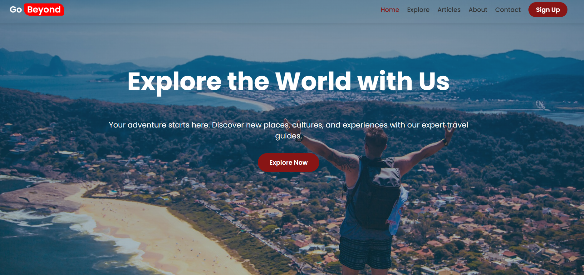

# Travel Booking Landing Page

A beautiful, responsive landing page for a fictional travel booking site — celebrating **Ethiopian adventures** and easy trip discovery. Built with pure **HTML** & **CSS** (optional light Vanilla JS for interactivity) — no frameworks!

<div align="center">
  
  <br><br>
  <em>Explore Ethiopian wonders: Bale Mountains, Lalibela, Danakil, and more! 🌍✈️</em>
</div>

## ✨ Live Demo

🌐 [View live site →](https://mikyyDev.github.io/travel-booking/)

## 📌 Features

- Modern, wanderlust-inspired design with adventurous Ethiopian vibe
- Fully responsive layout (mobile, tablet, desktop perfection)
- Hero section with prominent booking/search form (destination, dates, travelers)
- Grid showcase of popular Ethiopian destinations (Bale Mountains, Lalibela, Danakil Depression, Addis Ababa)
- Featured travel packages with prices, details & eye-catching cards
- Testimonials section to build trust & excitement
- Smooth scroll, hover effects, mobile menu toggle (if JS added)

## 🛠️ Technologies Used

- **HTML5** — semantic & accessible structure
- **CSS3** — Flexbox, Grid, media queries, transitions/animations
- **Vanilla JavaScript** (optional) — mobile menu, form hints, smooth scrolling

## 🎯 Project Highlights

Focused on showcasing Ethiopia's incredible natural & cultural sites while demonstrating clean, responsive web design skills using only vanilla technologies.

## 🚀 Run Locally

1. Clone the repo  
   ```bash
   git clone https://github.com/mikyyDev/travel-booking.git
